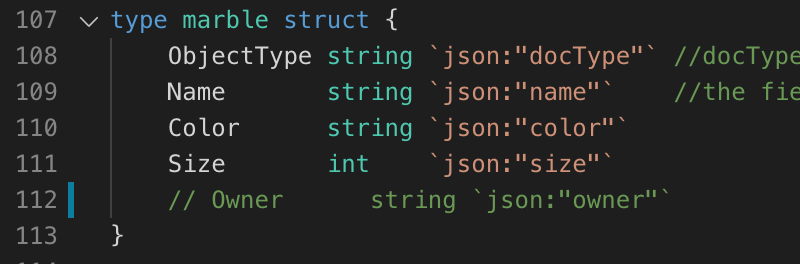
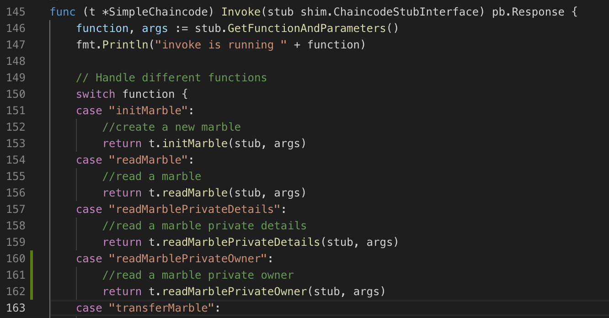
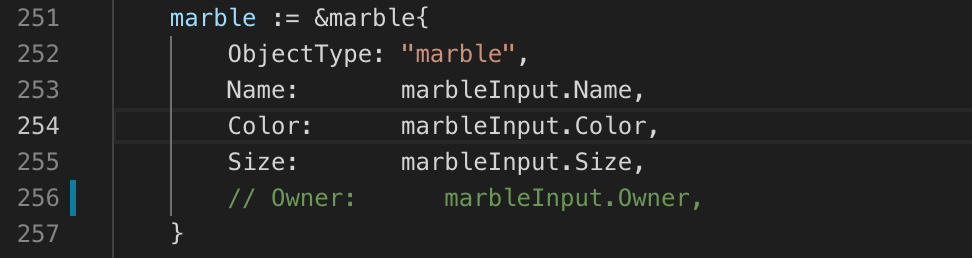
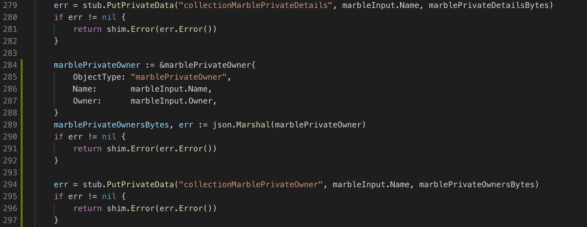
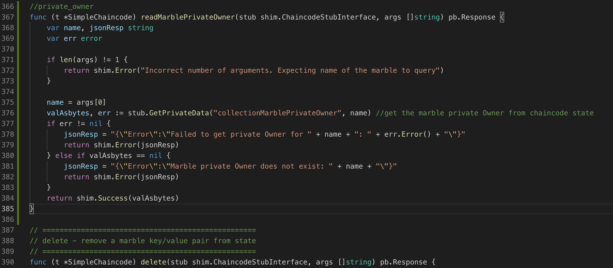
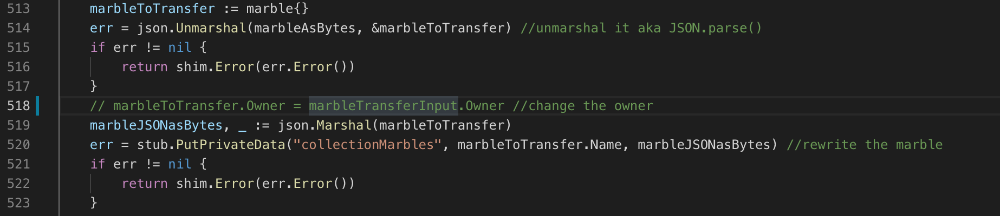

# private data 실습

서버 켜기 (couchdb)

```
./byfn.sh up -c mychannel -s couchdb
```

cli 접속

```
docker exec -it cli bash
```

체인코드 설치(모든피어)

(환경변수 설정에서 오류날시 포트번호 확인하고 맞추기)
```
peer chaincode install -n marblesp -v 1.0 -p github.com/chaincode/marbles02_private/go/

export CORE_PEER_ADDRESS=peer1.org1.example.com:8051
peer chaincode install -n marblesp -v 1.0 -p github.com/chaincode/marbles02_private/go/

```
Org2

```
export CORE_PEER_LOCALMSPID=Org2MSP
export PEER0_ORG2_CA=/opt/gopath/src/github.com/hyperledger/fabric/peer/crypto/peerOrganizations/org2.example.com/peers/peer0.org2.example.com/tls/ca.crt
export CORE_PEER_TLS_ROOTCERT_FILE=$PEER0_ORG2_CA
export CORE_PEER_MSPCONFIGPATH=/opt/gopath/src/github.com/hyperledger/fabric/peer/crypto/peerOrganizations/org2.example.com/users/Admin@org2.example.com/msp

export CORE_PEER_ADDRESS=peer0.org2.example.com:9051
peer chaincode install -n marblesp -v 1.0 -p github.com/chaincode/marbles02_private/go/

export CORE_PEER_ADDRESS=peer1.org2.example.com:10051
peer chaincode install -n marblesp -v 1.0 -p github.com/chaincode/marbles02_private/go/

```

체인코드 배포

(orderer_ca : 체인코드 배포전 검증)
```
export ORDERER_CA=/opt/gopath/src/github.com/hyperledger/fabric/peer/crypto/ordererOrganizations/example.com/orderers/orderer.example.com/msp/tlscacerts/tlsca.example.com-cert.pem

peer chaincode instantiate -o orderer.example.com:7050 --tls --cafile $ORDERER_CA -C mychannel -n marblesp -v 1.0 -c '{"Args":["init"]}' -P "OR('Org1MSP.member','Org2MSP.member')" --collections-config  $GOPATH/src/github.com/chaincode/marbles02_private/collections_config.json

```

peer0.org1로 변경

```
export CORE_PEER_ADDRESS=peer0.org1.example.com:7051
export CORE_PEER_LOCALMSPID=Org1MSP
export CORE_PEER_TLS_ROOTCERT_FILE=/opt/gopath/src/github.com/hyperledger/fabric/peer/crypto/peerOrganizations/org1.example.com/peers/peer0.org1.example.com/tls/ca.crt
export CORE_PEER_MSPCONFIGPATH=/opt/gopath/src/github.com/hyperledger/fabric/peer/crypto/peerOrganizations/org1.example.com/users/Admin@org1.example.com/msp
export PEER0_ORG1_CA=/opt/gopath/src/github.com/hyperledger/fabric/peer/crypto/peerOrganizations/org1.example.com/peers/peer0.org1.example.com/tls/ca.crt
```

marble1 데이터 생성-배포

```
export MARBLE=$(echo -n "{\"name\":\"marble1\",\"color\":\"blue\",\"size\":35,\"owner\":\"tom\",\"price\":99}" | base64 | tr -d \\n)

peer chaincode invoke -o orderer.example.com:7050 --tls --cafile /opt/gopath/src/github.com/hyperledger/fabric/peer/crypto/ordererOrganizations/example.com/orderers/orderer.example.com/msp/tlscacerts/tlsca.example.com-cert.pem -C mychannel -n marblesp -c '{"Args":["initMarble"]}'  --transient "{\"marble\":\"$MARBLE\"}"
```

marble1 데이터 조회

```
peer chaincode query -C mychannel -n marblesp -c '{"Args":["readMarble","marble1"]}'
```

marble1 private 데이터 조회(price)

```
peer chaincode query -C mychannel -n marblesp -c '{"Args":["readMarblePrivateDetails","marble1"]}'
```

peer0.org2로 변경해서 다시 조회 --> private 데이터는 조회되지 않음

(/fabric-samples/first-network/fabric-samples/chaincode/marbles02_private/collections_config.json 에서 확인가능)  

```
export CORE_PEER_ADDRESS=peer0.org2.example.com:9051
export CORE_PEER_LOCALMSPID=Org2MSP
export PEER0_ORG2_CA=/opt/gopath/src/github.com/hyperledger/fabric/peer/crypto/peerOrganizations/org2.example.com/peers/peer0.org2.example.com/tls/ca.crt
export CORE_PEER_TLS_ROOTCERT_FILE=$PEER0_ORG2_CA
export CORE_PEER_MSPCONFIGPATH=/opt/gopath/src/github.com/hyperledger/fabric/peer/crypto/peerOrganizations/org2.example.com/users/Admin@org2.example.com/msp

peer chaincode query -C mychannel -n marblesp -c '{"Args":["readMarble","marble1"]}'

peer chaincode query -C mychannel -n marblesp -c '{"Args":["readMarblePrivateDetails","marble1"]}'
```

지금까지 만든 블럭 조회

```
docker logs peer0.org1.example.com 2>&1 | grep -i -a -E 'private|pvt|privdata'
```

peer0.org1로 변경 --> 블럭 3개를 쌓아서 private data 삭제되는지 확인

```
export CORE_PEER_ADDRESS=peer0.org1.example.com:7051
export CORE_PEER_LOCALMSPID=Org1MSP
export CORE_PEER_TLS_ROOTCERT_FILE=/opt/gopath/src/github.com/hyperledger/fabric/peer/crypto/peerOrganizations/org1.example.com/peers/peer0.org1.example.com/tls/ca.crt
export CORE_PEER_MSPCONFIGPATH=/opt/gopath/src/github.com/hyperledger/fabric/peer/crypto/peerOrganizations/org1.example.com/users/Admin@org1.example.com/msp
export PEER0_ORG1_CA=/opt/gopath/src/github.com/hyperledger/fabric/peer/crypto/peerOrganizations/org1.example.com/peers/peer0.org1.example.com/tls/ca.crt

export MARBLE=$(echo -n "{\"name\":\"marble2\",\"color\":\"blue\",\"size\":35,\"owner\":\"tom\",\"price\":99}" | base64 | tr -d \\n)

peer chaincode invoke -o orderer.example.com:7050 --tls --cafile /opt/gopath/src/github.com/hyperledger/fabric/peer/crypto/ordererOrganizations/example.com/orderers/orderer.example.com/msp/tlscacerts/tlsca.example.com-cert.pem -C mychannel -n marblesp -c '{"Args":["initMarble"]}' --transient "{\"marble\":\"$MARBLE\"}" 

export MARBLE_OWNER=$(echo -n "{\"name\":\"marble2\",\"owner\":\"joe\"}" | base64 | tr -d \\n)

peer chaincode invoke -o orderer.example.com:7050 --tls --cafile /opt/gopath/src/github.com/hyperledger/fabric/peer/crypto/ordererOrganizations/example.com/orderers/orderer.example.com/msp/tlscacerts/tlsca.example.com-cert.pem -C mychannel -n marblesp -c '{"Args":["transferMarble"]}' --transient "{\"marble_owner\":\"$MARBLE_OWNER\"}"

export MARBLE_OWNER=$(echo -n "{\"name\":\"marble2\",\"owner\":\"tom\"}" | base64 | tr -d \\n)

peer chaincode invoke -o orderer.example.com:7050 --tls --cafile /opt/gopath/src/github.com/hyperledger/fabric/peer/crypto/ordererOrganizations/example.com/orderers/orderer.example.com/msp/tlscacerts/tlsca.example.com-cert.pem -C mychannel -n marblesp -c '{"Args":["transferMarble"]}' --transient "{\"marble_owner\":\"$MARBLE_OWNER\"}"

export MARBLE_OWNER=$(echo -n "{\"name\":\"marble2\",\"owner\":\"jerry\"}" | base64 | tr -d \\n)

peer chaincode invoke -o orderer.example.com:7050 --tls --cafile /opt/gopath/src/github.com/hyperledger/fabric/peer/crypto/ordererOrganizations/example.com/orderers/orderer.example.com/msp/tlscacerts/tlsca.example.com-cert.pem -C mychannel -n marblesp -c '{"Args":["transferMarble"]}' --transient "{\"marble_owner\":\"$MARBLE_OWNER\"}"
```

private data 조회해서 삭제됐나 확인
```
peer chaincode query -C mychannel -n marblesp -c '{"Args":["readMarblePrivateDetails","marble1"]}'
```

===============================================================================================


## Org2만 읽을수 있는 Collection 추가
#### (owner을 Org2만 볼수있게 설정)

fabric-samples/chaincode/marbles02_private/collections_config.json 파일에 추가

* 1. Org2에서만 보임
* 2. 1블럭후에 바로 삭제
```
 {
   "name": "collectionMarblePrivateOwner",
   "policy": "OR('Org2MSP.member')",
   "requiredPeerCount": 0,
   "maxPeerCount": 3,
   "blockToLive":1,
   "memberOnlyRead": true
 }
```


fabric-samples/chaincode/marbles02_private/go/marbles_chaincode_private.go 파일 수정








### 실습

```
./byfn.sh up -c mychannel -s couchdb

docker exec -it cli bash

```

#### 체인코드 설치+배포

```
peer chaincode install -n marblesp -v 1.0 -p github.com/chaincode/marbles02_private/go/

export CORE_PEER_ADDRESS=peer1.org1.example.com:8051
peer chaincode install -n marblesp -v 1.0 -p github.com/chaincode/marbles02_private/go/

```

Org2

```
export CORE_PEER_LOCALMSPID=Org2MSP
export PEER0_ORG2_CA=/opt/gopath/src/github.com/hyperledger/fabric/peer/crypto/peerOrganizations/org2.example.com/peers/peer0.org2.example.com/tls/ca.crt
export CORE_PEER_TLS_ROOTCERT_FILE=$PEER0_ORG2_CA
export CORE_PEER_MSPCONFIGPATH=/opt/gopath/src/github.com/hyperledger/fabric/peer/crypto/peerOrganizations/org2.example.com/users/Admin@org2.example.com/msp

export CORE_PEER_ADDRESS=peer0.org2.example.com:9051
peer chaincode install -n marblesp -v 1.0 -p github.com/chaincode/marbles02_private/go/

export CORE_PEER_ADDRESS=peer1.org2.example.com:10051
peer chaincode install -n marblesp -v 1.0 -p github.com/chaincode/marbles02_private/go/

```

체인코드 배포

(orderer_ca : 체인코드 배포전 검증)
```
export ORDERER_CA=/opt/gopath/src/github.com/hyperledger/fabric/peer/crypto/ordererOrganizations/example.com/orderers/orderer.example.com/msp/tlscacerts/tlsca.example.com-cert.pem

peer chaincode instantiate -o orderer.example.com:7050 --tls --cafile $ORDERER_CA -C mychannel -n marblesp -v 1.0 -c '{"Args":["init"]}' -P "OR('Org1MSP.member','Org2MSP.member')" --collections-config  $GOPATH/src/github.com/chaincode/marbles02_private/collections_config.json

```

marble1 데이터 생성-배포

```
export MARBLE=$(echo -n "{\"name\":\"marble1\",\"color\":\"blue\",\"size\":35,\"owner\":\"tom\",\"price\":99}" | base64 | tr -d \\n)

peer chaincode invoke -o orderer.example.com:7050 --tls --cafile /opt/gopath/src/github.com/hyperledger/fabric/peer/crypto/ordererOrganizations/example.com/orderers/orderer.example.com/msp/tlscacerts/tlsca.example.com-cert.pem -C mychannel -n marblesp -c '{"Args":["initMarble"]}'  --transient "{\"marble\":\"$MARBLE\"}"
```

marble1 데이터 조회

* price와 owner은 조회되지 않음

```
peer chaincode query -C mychannel -n marblesp -c '{"Args":["readMarble","marble1"]}'
```

marble1 private 데이터 조회(owner)

* org2이므로 확인가능

```
peer chaincode query -C mychannel -n marblesp -c '{"Args":["readMarblePrivateOwner","marble1"]}'
```

peer0.org1로 변경해서 확인 -> 조회x

```
export CORE_PEER_ADDRESS=peer0.org1.example.com:7051
export CORE_PEER_LOCALMSPID=Org1MSP
export CORE_PEER_TLS_ROOTCERT_FILE=/opt/gopath/src/github.com/hyperledger/fabric/peer/crypto/peerOrganizations/org1.example.com/peers/peer0.org1.example.com/tls/ca.crt
export CORE_PEER_MSPCONFIGPATH=/opt/gopath/src/github.com/hyperledger/fabric/peer/crypto/peerOrganizations/org1.example.com/users/Admin@org1.example.com/msp
export PEER0_ORG1_CA=/opt/gopath/src/github.com/hyperledger/fabric/peer/crypto/peerOrganizations/org1.example.com/peers/peer0.org1.example.com/tls/ca.crt

peer chaincode query -C mychannel -n marblesp -c '{"Args":["readMarblePrivateOwner","marble1"]}'
```

#### 블럭 쌓은후 데이터 삭제도 작동


